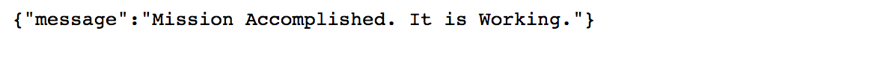

# Project 3

### What we plan to accomplish
In this project we will become familiar with:
1. Mongo DB
2. Node Js
3. Express
4. Postman

#### Before we start.
Download Postman
[Download Postman Link](https://www.getpostman.com/apps)

Confirm you have Mongo DB installed
[MongoDB Download Link](https://docs.mongodb.com/manual/installation/)

Have Express installed
[Express Download Link](https://expressjs.com/en/starter/installing.html)

Most importantly, we need Nodejs
[NodeJS Download Link](https://nodejs.org/en/)

If you have completed projects in the past with MongoDb, but are unsure it is installed run the following command.

`npm list mongoose`

Or to check globally,

`npm list -g  mongoose`
---
First let us set up the project folder structure.

### Project tree

 * [project3](./tree-md)
 * [models](./models)
   * [activity.js](./models/activity.js)
 * [node_modules](./node_modules)
 * [app.js](./app.js)
 * [package-lock.json](./package-lock.json)
 * [package.json](./package.json)


Next, navigate to your `package.json` file


Add the following lines of code.

```javascript
{
  "name": "project3",
  "version": "1.0.0",
  "description": "Project 3 example",
  "main": "app.js",
  "scripts": {
    "test": "echo \"Error: no test specified\" && exit 1"
  },
  "author": "Mr. Waldo",
  "license": "ISC",
  "dependencies": {
    "bcrypt": "*",
    "bluebird": "*",
    "body-parser": "*",
    "express": "*",
    "mongoose": "*",
    "passport": "*",
    "passport-http": "*"
  }
}
```

Next, open up your `app.js`

Add the following dependencies we will be using.
```javascript
const express = require('express')
const app = express();
const router = express.Router();
const bodyParser = require('body-parser');
const mongoose = require('mongoose');
const Book = require('./models/activity');
```

Before we check the connection,

We need to use *express js* to set up the routes and assign a port to listen to.
Open up `app.js`.

Then add the following lines of code.

```javascript
app.use('/api', router);
app.use(bodyParser.urlencoded({ extended: true}));
app.use(bodyParser.json());

app.get('/', function (req, res){
  res.json({message: 'Mission Accomplished. It is Working.'})
})

app.listen(4000);
console.log('Application is working.');
```

Now let us see if things are working.

Open up a terminal, then change the directory into the working project folder

i.e. (on unix) `cd ~/Documents/MyProjectsFolder/project3`

Next run `node app.js`

Check to see if things are working by going to `http://localhost:3000`, in your web browser




### Let us create a database

If you don't have mongo installed,

Follow this link
[Click Me](https://docs.mongodb.com/manual/installation/)

run mongo by typing `mongod` into a new terminal window

Next open a separate terminal tab, and type `mongo`

Enter the following scripts to create the database we will be using in this project
*This will create a bookstore database*

`use bookstore`


Next, enter

`show dbs`

The above will confirm that the database `bookstore` was created

### Now let us create a collection

Before we do, enter `;` to start a new command

Then type `db.createCollection("books")`

Confirm it is created by typing, `db.getCollectionNames()`

Which should return, `["books"]`
---
**Great**, now let us go to the next step, *connecting with mongoose*.

Go back to your `app.js` file

Enter the following:

```javascript
mongoose.Promise = require('bluebird')
mongoose.connect('mongodb://localhost:27017/bookstore')
```
Then add `next`, to app.get() function.
This will configure our router to go to the next request

```
app.get('/', function (req, res, next){...}
```

### Next go to your `activity.js` file,

 which is located in the `/models` folder.

Add the following lines of code:

```javascript
const mongoose = require('mongoose');

let Schema = mongoose.Schema;

const bookSchema = new Schema({
    book_name: String,
    author_name: String,
    genre: String,
  },{
    timestamps: true
});

const Book = mongoose.model('Books', bookSchema);

module.exports = Book
```


Go back to your `app.js` file and confirm you have the below entered

```javascript
const express = require('express')
const app = express();
const router = express.Router();
const bodyParser = require('body-parser');
const mongoose = require('mongoose');
const Book = require('./models/activity');


app.use('/api', router);
app.use(bodyParser.urlencoded({ extended: true}));
app.use(bodyParser.json());

mongoose.Promise = require('bluebird')
mongoose.connect('mongo://localhost:27017/bookstore')

app.get('/', function (req, res, next){
  res.json({message: 'Mission Accomplished. It is Working.'})
})

app.listen(3000);
console.log('Application is working.');
```

# Quick review of HTTP CRUD Methods
```
GET  ./api/books Will Show a list of book titles

POST ./api/books will create a new book

PUT ./api/books will update or replace a book. It can also create a book title

PATCH ./api/books can be used to modify a book

DELETE ./api/books will delete a book title
```
---
Now let us create new CRUD routes that will go in the `app.js` file

### Express to the rescue

After the following lines of code,

```javascript
app.get('/', function (req, res, next){
  res.json({message: 'Mission Accomplished. It is Working.'})
})
```

Enter the following:

```javascript
//get- request all books
app.get('/api/books', function(req,res){
  Book.find({}).then(eachOne => {
    res.json(eachOne);
  })
})
```

`app.get`will match and handle the HTTP route in this case `/api/books`

`Book` is the MongoDb model, that we created in `/models/activity.js`


#### What about adding a book?

Copy and paste the following in your `app.js` file.

```javascript
//post - create a book
app.post('/api/books', function(req,res){
  Book.create({
    book_name: req.body.book_name,
    author_name: req.body.author_name,
    genre: req.body.genre
  }).then(book => {
    res.json(book)
  })
})
```

#### Let us try to get a book by its id
```javascript
//get - request a book by its id
app.get('/api/books/:books_id', function(req, res){
  Book.findById(req.params.books_id).then(function(err,
    book){
      if(err){
        res.send(err)
      }
      res.json(book)
    })
})
```
#### Update
It is also possible to update a book by its id using the mongodb function `findOneAndUpdate`

```javascript
//update by id
app.put('/api/books/:books_id', function(req, res){
  Book.findOneAndUpdate({
    book_name: req.body.book_name,
    author_name: req.body.author_name,
    genre: req.body.genre
  }).then(book => {
    res.json(book)
  })
})
```

What about deleting?
Even easier. Enter the following

```javascript
//delete by id
app.delete('/api/books/:books_id', function(req, res){
  Book.findOneAndRemove({
    _id: req.params.books_id
  }).then(book => {
    res.json(book)
  })
})
```


### How can we tell it is working?
Let us use postman.
Just in case, make sure mongo is running in a separate terminal `$ mongo`

[Download Postman Link](https://www.getpostman.com/apps)

Post Man Get


Post Man Create


### MongoDB Helpful Commands

```
show dbs - Show all databases
use mydatabase - Create a database
db.createCollection("user") - Create a users collection
show collections - Show all collections in Database
```
Insert a new record into the collection `user`
```
db.user.insert({"name": "Mr. Waldo", "location": "Unknown", "username": "whereisWaldo"})

```

Insert many users

```
db.collection.insertMany([
  {"name": "SpongeBob", "location": "Under Water", "username": "SquarePants"}),
  {"name": "Jimmy Neutron", "location": "Retroville", "username": "heyJimmy"})
  ])
```
Display a list of records

```
db.user.find()
```

Delete a Collection
```
db.user.drop()
```
